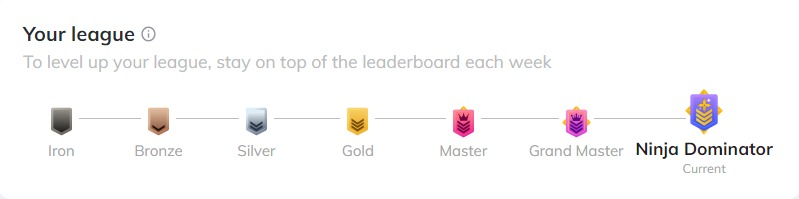

# 💫 About Me:
A student of engineering currently practicing Data Analytics and front-end development, #Engineer #Tech #Development

## 🌐 Socials:
    

# 💻 Tech Stack:
         	  
# 📊 GitHub Stats:
 
 

## 🏆 GitHub Trophies

### ✍️ Random Dev Quote

---

<!-- Proudly created with GPRM ( https://gprm.itsvg.in ) -->
